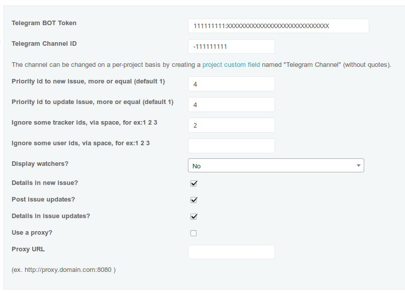

Source from [Slack plugin](https://github.com/sciyoshi/redmine-slack)

# Telegram global messages for Redmine

This plugin posts issues updates via Telegram. 

## Installation

From your Redmine plugins directory, clone this repository as `redmine_telegram_global` (note
the underscore!):

    git clone https://github.com/massdest/redmine_telegram_global redmine_telegram_global

You will also need the `httpclient` dependency, which can be installed by running

    bundle install

from the plugin directory.

Start migration command

	rake redmine:plugins:migrate RAILS_ENV=production

Restart Redmine, and you should see the plugin show up in the Plugins page.

## Using

Create project custom field named "Telegram Channel" for ex: http://example.com/custom_fields/new?utf8=%E2%9C%93&type=ProjectCustomField (without quotes).

Or for all projects - http://example.com/settings/plugin/redmine_telegram_global

## Update plugin

Go to plugin girectory and pull last version
	
	git pull origin master

Then start migration database to new version

	rake redmine:plugins:migrate RAILS_ENV=production

Last step - restart your web-server to apply changes.

Now you can use last version.

## Uninstall

From Redmine plugin directory run command

	rake redmine:plugins:migrate NAME=redmine_telegram_global VERSION=0 RAILS_ENV=production

After that restart Redmine.

For more information, see http://www.redmine.org/projects/redmine/wiki/Plugins.

